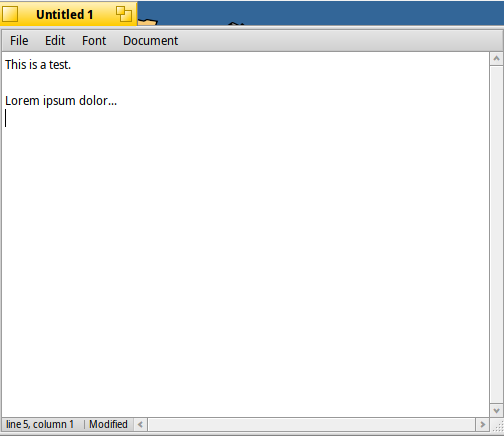
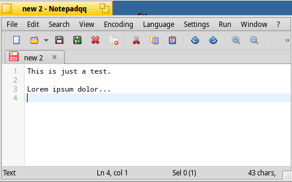
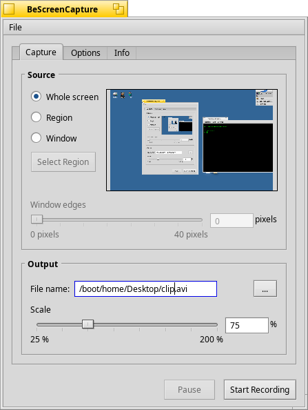
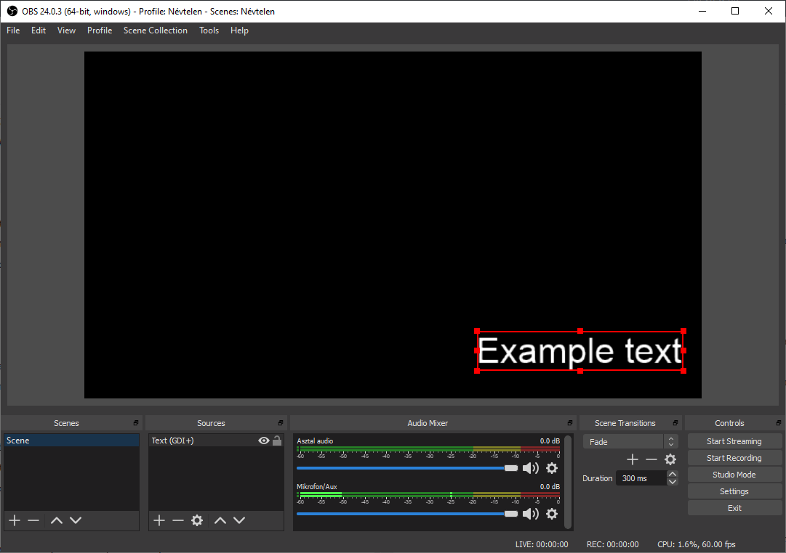
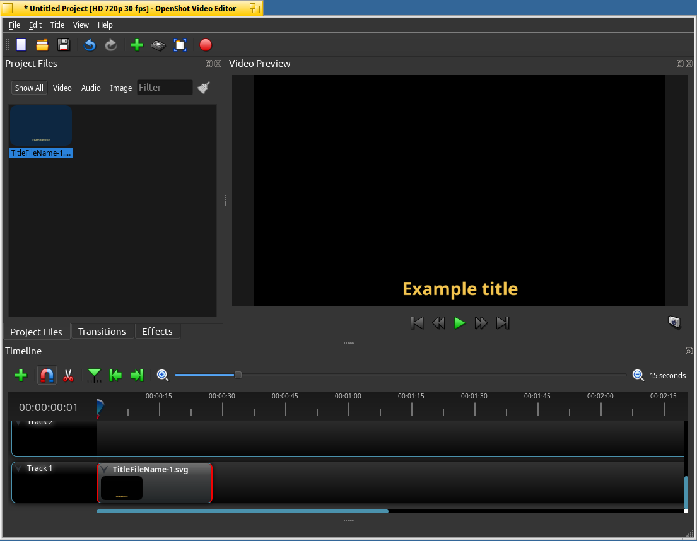
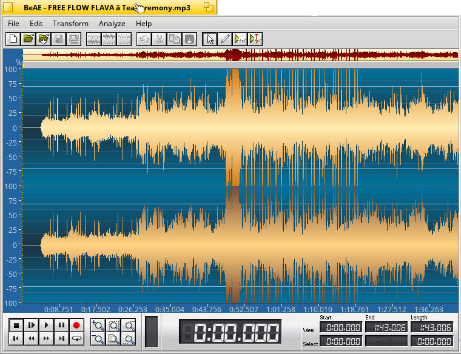

# How to make a tutorial video in Haiku?

_It seems that it's very complicated, but it's actually not. In this article I'm going to show you how to create such a video in Haiku. I'll also give you some hints on how to make a tutorial followable and enjoyable while also listing some tools that can help you in creating a tutorial video._

## So how to get started?
Let's say you have a topic that you want to present to the audience in the form of a video and you also have a basic idea in your mind about the things you want to show.
If it's all done up to this point, that's a great start, good job!
Now the question is:

> "Where to begin?"

My advice is to first make a tiny sketch or take some notes about how you're planning to show the things in your video. It doesn't have to be a complete script, nothing too fancy, just the main ideas.

### Example
Let's assume that your video is about how to open WebPositive in Haiku.
You should write down the major steps that you have complete to get there.
1. Open the leaf, which is located in the top-right corner!
2. Go to the applications menu point!
3. Click on WebPositive!
After that, I would first try to follow along the steps I wrote, and see if I could get to the desired destination.

## Write a more in-depth, detailed script
Even if you know your topic, and you feel like you could improvise, that's not always the best solution.
**I highly recommend you to write a script.**
_Personally, even though I'm not afraid of improvising (as I'm part of our school's drama club), I usually write a script before I make a video._

## Record the video
It's almost as easy as it sounds, except it's not.
Just kidding, it varies from a painful and endless to a beautiful and lovely activity.
It matters how you do it.
Just record it first and after that, if you're not sure how you performed, or whether you'll have enough resource for editing, you should re-record the parts that you're not completely satisfied with.

## Make some final adjustments, edit the video
If you've done a great job with recording, that can make your life easier, but it's almost unavoidable to make some tiny edits to your clips.
To let the video be more followable, it's good to add a title to each step as you go.

## Tips and Tricks
* Speak **slowly** and articulate!
* Be **confident**!
* You can have **some** jokes, but do it in moderation.
* Try to explain each step in a way that's **easily understood** by the target audience!
* Don't overcomplicate things! **Less is more**.
* **Watch your video** when you're done, and try to follow it along!
* You don't have to record the sound at the same time as the visuals. You can do it afterwards.
* Try to **avoid putting music into the background** of the tutorial, or if you deem it absolutely necessary, only do it when it's appropriate and not too distracting.

## Tools to create wonderful videos
There are endless tools for scripting/recording/editing, but if you need some help in finding a good one for you, I'll give you some choices.
Here I primarily listed the tools available for Haiku, but it's not too difficult to find some programs for the major operating systems like Windows, Linux, or Mac OS.

### For writing the script
* StyleEdit 
 * It comes with Haiku.
 * It doesn't have too many options, but it's irrelevant, since scripting doesn't require any formatting.
* Pe
 * It also comes with Haiku.
 * It has more formatting features than StyleEdit.
* LibreOffice
 * A fully-featured document editor.
* Notepadqq 
 * The famous Windows-only text editor (Notepad++)'s copy for Haiku
 * Very useful for programming by the way.

### For recording the video
* BeScreenCapture 
 * Great for recording the screen.
 * It has an active developer community.
* FFMpeg
 * By default, it's only accessable from the terminal, but it's also a highly customisable video and sound recorder.
* OBS 
 * It hasn't been ported to Haiku yet, but if you're running Haiku as a guest in a Virtual Machine, it's a highly customisable video recorder software.

### For editing the video
* OpenShot 
 * Can be downloaded from HaikuDepot.
* Kdenlive
 * Unfortunately this is not available for Haiku.

### For recording and editing sounds
* BeAE 
 * It's a useful audio editor for Haiku.
 * It's no longer maintained.
* Audacity 
 * A great cross-platform audio software.
  * but hasn't been ported to Haiku yet
 * It has enormous amount of options.

In the end, I believe that by being aware of the main points I've mentioned here, everyone can make a great and helpful tutorial video.

Help people by making tutorials. Cheers!

_Author: Zoltán Szatmáry_
